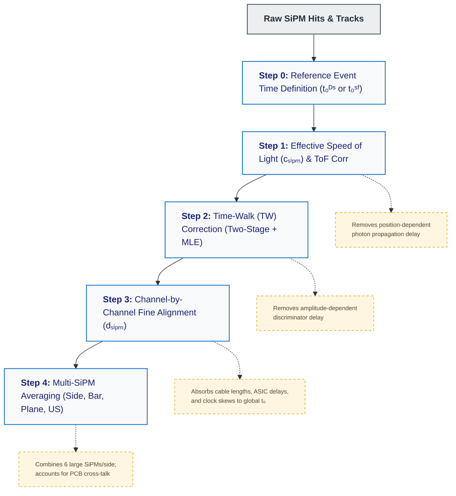
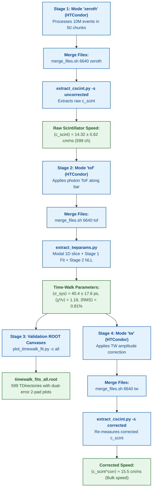

# Upstream Scintillator (US) Timing Calibration & Alignment Guide

This document provides a comprehensive overview of the timing calibration, time-walk (TW) correction, and channel alignment procedure for the Upstream Scintillator (US) system in **SND@LHC**, as developed in [dissertation_conaboy_andrew.pdf](file:///afs/cern.ch/work/i/idioniso/sndVetoUS/sndsw/dissertation_conaboy_andrew.pdf) (Chapter 4) and implemented in the [`sndsw`](file:///afs/cern.ch/work/i/idioniso/sndVetoUS/sndsw) framework.

---

## 1. Overview of the Procedure Workflow

The timing calibration workflow transforms raw SiPM TDC timestamps into high-precision, synchronized physics times via a 4-step sequence:



---

## 2. Step 0: Reference Event Time ($t_0$)

To study single-channel timing responses without event-to-event LHC bunch jitter or global start time offsets, an event-wise reference time $t_0$ is defined:

### 2.1 Downstream Reference Time ($t_0^{DS}$) — Equation 4.1.1
Used for single-muon events (`referencesystem = 3`):
$$t_0^{DS} = \frac{1}{N_{DSH}} \sum_{i=1}^{N_{DSH}} t_{DSH, i}$$
where each horizontal DS bar average is:
$$t_{DSH, i} = \frac{1}{2} (t_{i, \text{left}} + t_{i, \text{right}})$$

> **Geometric Cancellation:** Because scintillation light travels to both ends with effective speed $c$, the average $t_{DSH} = \frac{1}{2} [ (t_{hit} + x/c) + (t_{hit} + (L-x)/c) ] = t_{hit} + \frac{L}{2c}$ is completely **independent of the horizontal hit position $x$**. This produces a clean, sharp reference time with intrinsic resolution $\sigma(t_0^{DS}) \approx 263\text{ ps}$.

### 2.2 SciFi Reference Time ($t_0^{SF}$) — Equation 4.1.2
Used when no muon reaches the DS (e.g., zero-muon neutrino interactions, `referencesystem = 1`):
$$t_0^{SF} = \frac{1}{N} \sum_{i=1}^{N} t_{SiPM, i}^{SF}$$

For every US SiPM channel, raw relative times are defined as:
$$dt_{SiPM} = t_0^{DS} - t_{SiPM}$$

---

## 3. Step 1: Effective Speed of Light Determination ($c_{SiPM}$)

### 3.1 Physics Motivation
Scintillation photons emitted at track position $x$ travel along the bar before reaching the SiPM. Across an $82.5\text{ cm}$ bar, propagation time varies by up to $\sim 6\text{ ns}$. If this is not corrected first, it washes out the amplitude-dependent time-walk effect.

### 3.2 Methodology (Section 4.1.3)
1. Extrapolate reconstructed DS tracks to the $z$-position of the US plane to obtain $(x_{track}, y_{track})$.
2. Correlate raw relative time $dt_{SiPM} = t_0^{DS} - t_{SiPM}$ against $x_{track}$ in a 2D histogram.
3. For each $x$-slice, extract the Most Probable Value (MPV) of $dt_{SiPM}$.
4. Fit a linear relationship (Equation 4.1.4):
   $$dt_{SiPM} = \pm \frac{x}{c_{SiPM}} + \text{const}$$
   *(Positive slope for left-side SiPMs, negative slope for right-side SiPMs due to coordinate system orientation).*
5. Extract $c_{SiPM} \approx 14\text{--}16\text{ cm/ns}$.
6. **Systematic Uncertainty:** The fit range $[A - 5\text{ cm}, L_\mu]$ is divided into 5 equal segments; the variance across sub-measurements gives the systematic uncertainty on $c_{SiPM}$ (Equation 4.1.6).

### 3.3 Photon Time-of-Flight (ToF) Correction (Equations 4.1.7 & 4.1.8)
Correct the time to the reference bar center ($x_{ref} = \frac{A_x + B_x}{2}$):
$$t_\gamma = \frac{x_{track} - x_{ref}}{c_{SiPM}}$$
$$t_{SiPM}^{ToF} = \begin{cases} t_{SiPM} + t_\gamma & \text{for left SiPMs} \\ t_{SiPM} - t_\gamma & \text{for right SiPMs} \end{cases}$$
$$dt_{SiPM}^{ToF} = t_0^{DS} - t_{SiPM}^{ToF}$$

---

## 4. Step 2: Time-Walk (TW) Correction & Two-Stage Fitting

### 4.1 Physics Motivation
Due to the leading-edge discriminator in the TOFPET2 ASIC, smaller signals (low QDC) cross the threshold later than larger signals (high QDC).

### 4.2 Time-Walk Parameterisation (Equation 4.1.9)
$$\Delta t_{TW}(QDC) = t_0 + \frac{\alpha}{\beta \cdot QDC - QDC_0} + \gamma \cdot QDC$$

* Parameter bounds established from Table 4.2:
  * $t_0 \in [0.5, 1.5] \times t_0^{\text{estimate}}$
  * $\alpha \in [-500, 0]$ (negative amplitude bend)
  * $\beta \in [0, 30]$
  * $QDC_0 \in [-10, 0]$
  * $\gamma \in [0, 1]$

### 4.3 Why Two-Stage Fitting? (Section 4.3.4)
Because the QDC follows a convolved Landau-Gaussian distribution, high-density bins near the MPV have huge statistics and tiny standard errors ($\sigma_{stat} = \text{SEM} \sim \text{few ps}$). A direct $\chi^2$ fit results in unphysically massive $\chi^2/\text{ndf} \sim 100\text{--}2500$ because systematic variations dominate.

1. **Stage 1 (Shape Extraction):**
   * Slices the 2D correlation into 1D timing projections (`ProjectionY`) for each QDC bin, taking the **modal value (peak bin)** as $y_i$ and the Standard Error on the Mean ($\text{SEM} = \frac{\text{RMS}}{\sqrt{N}}$) as statistical weight.
   * Fits the function unweighted (minimising direct residuals, ignoring statistical error bars) over $[0, QDC_{max}]$.
   * Establishes the underlying physical parameters $(\alpha, \beta, QDC_0, \gamma, t_0)$.
2. **Stage 2 (MLE for Systematic Error Floor):**
   * Construct the Negative Log-Likelihood (NLL, Equation 4.3.6) assuming total error $\sigma^2 = \sigma_{stat}^2 + \sigma_{sys}^2$:
     $$\text{NLL}(\theta) = \frac{1}{2} \sum_{i=1}^{N} \left[ \frac{(y_i - f(x_i; \theta))^2}{\sigma_{stat, i}^2 + \sigma_{sys}^2} + \ln(\sigma_{stat, i}^2 + \sigma_{sys}^2) \right]$$
   * Numerically minimise NLL using SciPy to find the optimal error floor $\sigma_{sys}$ ($\approx 40.4\text{ ps}$).
   * Re-evaluate $\chi^2/\text{ndf}$ with total errors $\sigma_i = \sqrt{\sigma_{stat, i}^2 + \sigma_{sys}^2}$, yielding proper $\chi^2/\text{ndf} \approx 1.19$.

### 4.4 Applying the TW Correction (Equation 4.1.11 / [`AnalysisFunctions.py`](file:///afs/cern.ch/work/i/idioniso/sndVetoUS/sndsw/python/AnalysisFunctions.py#L53))
$$t_{SiPM}^{TW} = t_{SiPM} + \left( \frac{\alpha}{\beta \cdot QDC - QDC_0} + \gamma \cdot QDC \right)$$

---

## 5. Step 3: Channel-by-Channel Fine Alignment ($d_{SiPM}$)

### 5.1 Physics Motivation (Section 4.1.7)
Even after ToF and TW corrections, individual SiPM channels have static time offsets due to:
* Differences in readout cable lengths
* Channel-to-channel TOFPET ASIC internal propagation delays
* SiPM internal transit time variations
* DAQ clock distribution offsets

### 5.2 Alignment Parameter Extraction ($d_{SiPM}$)
1. Form the 1D projection of fully corrected residual: $dt_{SiPM}^{TW, ToF} = t_0^{DS} - t_{SiPM}^{TW, ToF}$.
2. Compute the **truncated mean** within $\pm 1\sigma$ around the modal value.
3. The alignment constant $d_{SiPM}$ is this truncated mean.
4. Correct the event-wise time:
   $$dt_{SiPM}^{aligned} = t_0^{DS} - t_{SiPM}^{TW, ToF} - d_{SiPM} \approx 0\text{ ns}$$

---

## 6. Summary of Calibration Files & Code Reference

### 6.1 Calibration Output Files
* `cscintvalues/runXXXXXX/runXXXXXX_cscintvalues_uncorrected.json`: Raw speed of light values.
* `cscintvalues/runXXXXXX/runXXXXXX_cscintvalues_corrected.json`: Time-walk corrected speed of light.
* `Polyparams/runXXXXXX/twparams.json`: Global channel time-walk parameter dictionary.
* `Polyparams/runXXXXXX/polyparams9_{fixed_ch}.json`: Per-channel JSON time-walk parameters.
* `Polyparams/runXXXXXX/polyparams9_{fixed_ch}.csv`: Per-channel CSV parameters.

---

## 7. Concrete Operational Pipeline & Executed Workflow (Run 6640)

Below is the chronological log of all scripts developed, commands executed, and physics outputs generated for the timing calibration of **Run 6640** (Physics 2022 dataset).



---

### Step-by-Step Executed Scripts & Commands

#### 1. Uncorrected Scintillator Speed Extraction (Mode `zeroth`)
* **Job Submission**:
  ```bash
  cd /afs/cern.ch/work/i/idioniso/sndVetoUS/htcondor
  python3 generate_args_timewalk.py -r 6640 -m zeroth -n 10000000 -c 200000 -o args_timewalk_zeroth.txt
  condor_submit 0_timewalk.sub
  ```
* **Merging**:
  ```bash
  ./merge_files.sh 6640 zeroth
  ```
* **Extraction Command**:
  ```bash
  python3 /afs/cern.ch/work/i/idioniso/sndVetoUS/sndsw/shipLHC/scripts/extract_cscint.py \
    -r 6640 \
    -p /afs/cern.ch/work/i/idioniso/sndVetoUS-physics2022/ \
    -s uncorrected \
    --plot
  ```
* **Physical Result**:
  * Total Fitted Channels: **599 / 599** (0 failed)
  * Mean Scintillator Speed: **$\langle c_{\text{scint}} \rangle = 14.32 \pm 0.62\text{ cm/ns}$** (Left: $14.24\text{ cm/ns}$, Right: $14.40\text{ cm/ns}$)
  * Outputs: `cscintvalues/run006640/run006640_cscintvalues_uncorrected.json`, `cscint_summary_uncorrected.root`.

---

#### 2. Photon Propagation Correction (Mode `tof`)
* **Job Submission & Merging**:
  ```bash
  python3 generate_args_timewalk.py -r 6640 -m tof -n 10000000 -c 200000 -o args_timewalk_tof.txt
  condor_submit 0_timewalk.sub
  ./merge_files.sh 6640 tof
  ```
* **Output**:
  Generates `dtvqdc_{fixed_ch}_uncorrected` 2D histograms (Photon ToF subtracted, ready for amplitude time-walk parameterisation).

---

#### 3. Time-Walk Calibration & NLL Optimization
* **Extraction Command**:
  ```bash
  python3 /afs/cern.ch/work/i/idioniso/sndVetoUS/sndsw/shipLHC/scripts/extract_twparams.py \
    -r 6640 \
    -p /afs/cern.ch/work/i/idioniso/sndVetoUS-physics2022/
  ```
* **Physical Result**:
  * Total Channels Fitted: **599 / 599** (0 failed)
  * Mean Systematic Error Floor: **$\langle \sigma_{\text{sys}} \rangle = 40.4 \pm 17.6\text{ ps}$** (Target: $\approx 40\text{ ps}$, [thesis §4.1.4](file:///afs/cern.ch/work/i/idioniso/sndVetoUS/sndsw/dissertation_text.txt#L5090))
  * Mean $\chi^2/\nu$: **$1.19$** (Target: $\approx 1.0$)
  * Mean RMS Residual: **$0.81\%$** (Target: $< 1.0\%$)
  * Outputs: `Polyparams/run006640/twparams.json`, `polyparams9_{fixed_ch}.json`, `twparams_summary.root`.

---

#### 4. Publication-Quality Validation ROOT Canvases
* **Single-Channel Validation**:
  ```bash
  python3 /afs/cern.ch/work/i/idioniso/sndVetoUS/sndsw/shipLHC/scripts/plot_timewalk_fit.py \
    -r 6640 \
    -p /afs/cern.ch/work/i/idioniso/sndVetoUS-physics2022/ \
    -c 24005_4
  ```
* **Full Detector Export (599 Channels)**:
  ```bash
  python3 /afs/cern.ch/work/i/idioniso/sndVetoUS/sndsw/shipLHC/scripts/plot_timewalk_fit.py \
    -r 6640 \
    -p /afs/cern.ch/work/i/idioniso/sndVetoUS-physics2022/ \
    -c all
  ```
* **Features Included**:
  * Upper Pad: 2D $dt$ vs $\text{QDC}$ histogram, statistical $\text{SEM}$ points, semi-transparent **total uncertainty shaded error band** ($\text{SEM} \oplus \sigma_{\text{sys}}$), and fitted 5-parameter rational curve.
  * Lower Pad: Data/Fit ratio with shaded systematic envelope and unity reference line.
  * Legend: Full parameter readout $[t_0, \alpha, \beta, \text{QDC}_0, \gamma]$, $\sigma_{\text{sys}}$, RMS residual, and $\chi^2_{\text{stat}}/\nu \rightarrow \chi^2_{\text{tot}}/\nu$.
  * Multi-Channel Export: Consolidated file `rootfiles/run006640/timewalk_fits_all.root` with per-channel `TDirectory` folders.

---

#### 5. Time-Walk Corrected Scintillator Speed (Mode `tw` — Active Stage)
* **Job Submission**:
  ```bash
  cd /afs/cern.ch/work/i/idioniso/sndVetoUS/htcondor
  condor_submit 0_timewalk.sub
  ```
* **Post-Processing (After Jobs Complete)**:
  ```bash
  ./merge_files.sh 6640 tw
  python3 /afs/cern.ch/work/i/idioniso/sndVetoUS/sndsw/shipLHC/scripts/extract_cscint.py \
    -r 6640 \
    -p /afs/cern.ch/work/i/idioniso/sndVetoUS-physics2022/ \
    -s corrected \
    --plot
  ```
* **Physical Target**: $\langle c_{\text{scint}}^{\text{corr}} \rangle \approx \mathbf{15.5\text{ cm/ns}}$ ([thesis Fig. 4.26](file:///afs/cern.ch/work/i/idioniso/sndVetoUS/sndsw/dissertation_text.txt#L6591)).
